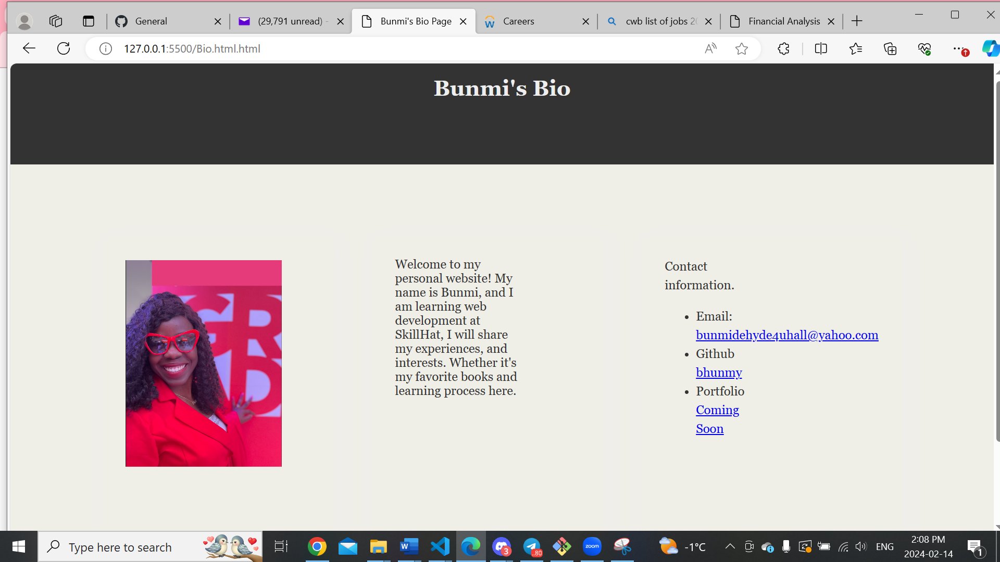
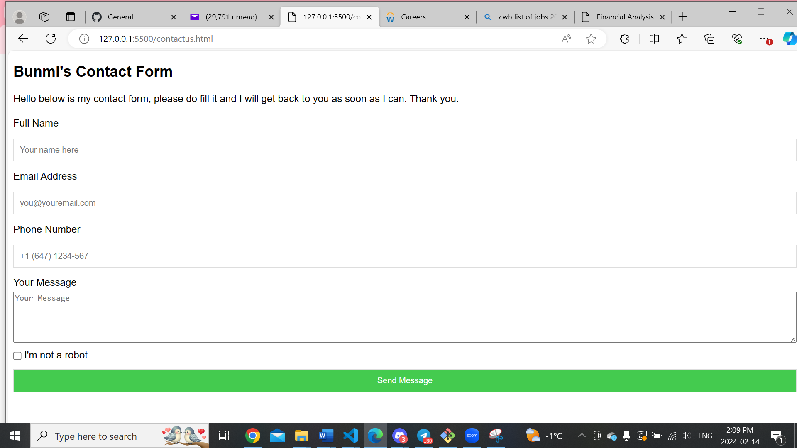

# BunmiPortfolio
This is my generic portfolio that describes all works done up till date
Welcome to my web developer portfolio! This project showcases my skills, projects, and contact information to provide an overview of my capabilities and experience in web development.

## Table of Contents

- [Introduction]
- [Features]
- [Screenshots]
- [Technologies Used]
- [Projects]
- [Skills]
- [Contact Me]

## Introduction

This portfolio serves as a platform to demonstrate my proficiency as a web developer. It includes sections such as the home tab, work tab, skills tab, about and a contact.

## Features

- **Home Tab:** Provides a brief introduction to me and my background as a web developer.
- **Work Tab:** Showcases my projects with descriptions and links to live demos or repositories.
- **Skills Tab:** Highlights my technical skills and expertise in various programming languages, frameworks, and tools.
- **Contact Us Tab:** Offers a contact form or information on how to reach out to me for inquiries or collaboration opportunities.

## Screenshots

.

## Technologies Used

The following technologies were used to develop my portfolio website.

- HTML
- CSS
- JavaScript
-
## Projects

1. Project Name : Console Finance
   - Description: This project consists of a JavaScript script that analyzes financial data provided in a dataset. The script calculates various financial metrics such as the total number of months included in the dataset, the net total amount of profit/losses over the entire period, the average of the changes in profit/losses, and identifies the greatest increase and decrease in profit/losses along with their corresponding date

   - Repository: https://github.com/bhunmy/ConsoleFinances

2. Project Name 2: Bio page
   - Description: A brief description of myself on a web page
   - Repository: https://github.com/bhunmy/BioBhunm.git

3.  Project Name 3: Password Generator
   - Description: This is a simple web-based password generator that allows users to specify the length of the password and select the types of characters to include. The generated password is displayed either in an alert or on the web page itself.
    -Repository: https://bhunmy.github.io/Password-Generator/

## Skills

My technical skills and expertise in various areas of web development.

 HTML, CSS, JavaScript, React.js, etc.
- 
## Contact Me

- Email:Bunmidehyde4uhall@yahoo.com
- LinkedIn: www.linkedin/Bunmi Orenolu
- GitHub: https://github.com/bhunmy
- Website:https://github.com/bhunmy/BunmiPortfolio

Feel free to reach out to discuss potential projects, collaborations, or opportunities!